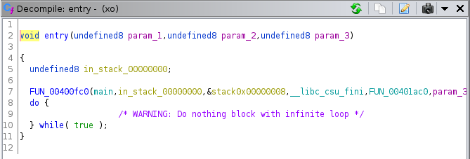
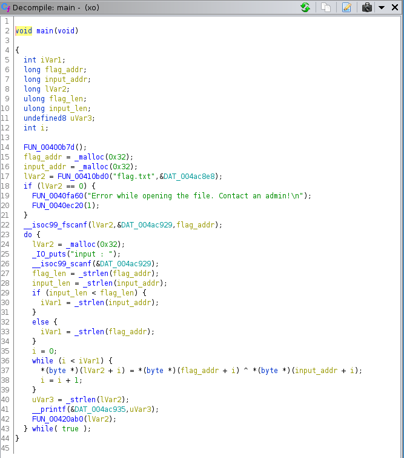

# xo
## slopey | 8/30/2020

TL;DR: Flag XOR'd with user input. Prints strlen of output. 

We are given a stripped, statically linked binary. Running the binary, we get the output:
```
$ ./xo
Error while opening the file. Contact an admin!
: No such file or directory
```
We can simply add a fake flag in `flag.txt` and the program runs properly. Testing it a few times, this is our output:
```
$ ./xo
input :
asdf
4
input :
asdfasdf
8
input :
Fword
0
input :
FwordCTF
0
```
At first glance, it seems that the program simply returns the length of our input, but returns 0 if our input matches the flag. I wasted quite a bit of time trying to write a solve script for this as I was lazy to actually analyze the binary. As you can see, we can easily get very unexpected behaviour:
```
$ ./xo
input :
Fwwwwwwww
0
input :
Fagsodighjaowiehjg
0
input :
asdlfasfdF
14
```
So now, let's actually try to take a look at the binary itself. Since this was a statically linked binary, I used [this](https://github.com/NWMonster/ApplySig) Ghidra script to apply function signatures using [this database](https://github.com/push0ebp/sig-database). I used a random Ubuntu libc, but it was pretty much useless and only identified 1-2 functions in main.

We can identify where main is by simply going to the entry function. 



Here, I have already marked the main function. Entry calls a libc function which starts the main function, and the first parameter is main. After we locate main, we can simply go through the function and figure out which functions are which by analyzing the return values and parameters in GDB. Also a lot of them can be revealed through simply looking at the context. After labelling the functions, we get a much more readable decompiled view.



Here is the shortened, Python equivalent:
```python
garbage = ""
for a, b in zip(flag, input):
  garbage += chr(ord(a) ^ ord(b))
print(len(garbage))
```
Essentially, if flag[i] == input[i], then a null byte will be added to `garbage` since the xor of the same number is 0. In C, strings are terminated with a null byte. Therefore, when we get the length of `garbage`, it returns the number of characters before the null byte.

We can easily write a script to brute force the flag. Basically, if we know the flag to be `FwordCTF{flag}`, then an input of `F` should output 0 since the first character matches. This yields a null byte, so effectively there are no characters in `garbage`. Here is the important part: if we give the input of `.w`, the output should be 1. the xor of "." and "F" results in some value, but "w" xor "w" is zero. Effectively, there is only one character in the resulting string. Note that I use the character "." because it will not be a character in the string.

We can try all characters and slowly increment the payload and if the script returns the length of our payload minus 1, then our guess is correct. [Here](xo.py) is a script I wrote in Python to brute force the flag:
```python
from pwn import remote
import string

r = remote("xo.fword.wtf", 5554)
alpha = string.ascii_letters + string.digits + "{}_?!"
flag = ""

# I don't know how long the flag is, I'll just use an 
# infinite loop and stop when the flag stalls.
while True:
    for c in alpha:
        r.recvline()
        payload = len(flag) * "." + c
        r.sendline(payload)
        output = int(r.recvline().strip())
        if output == len(flag):
            flag += "."
            print(c, end="")
            break
```
Running this takes a bit, but eventually we get our flag:
```
NuL1_Byt35?15_IT_the_END?Why_i_c4nT_h4ndl3_That!
```
